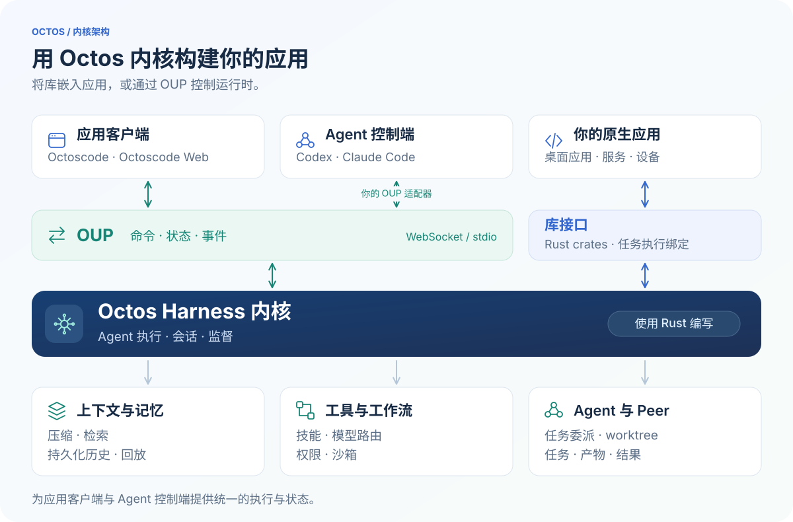
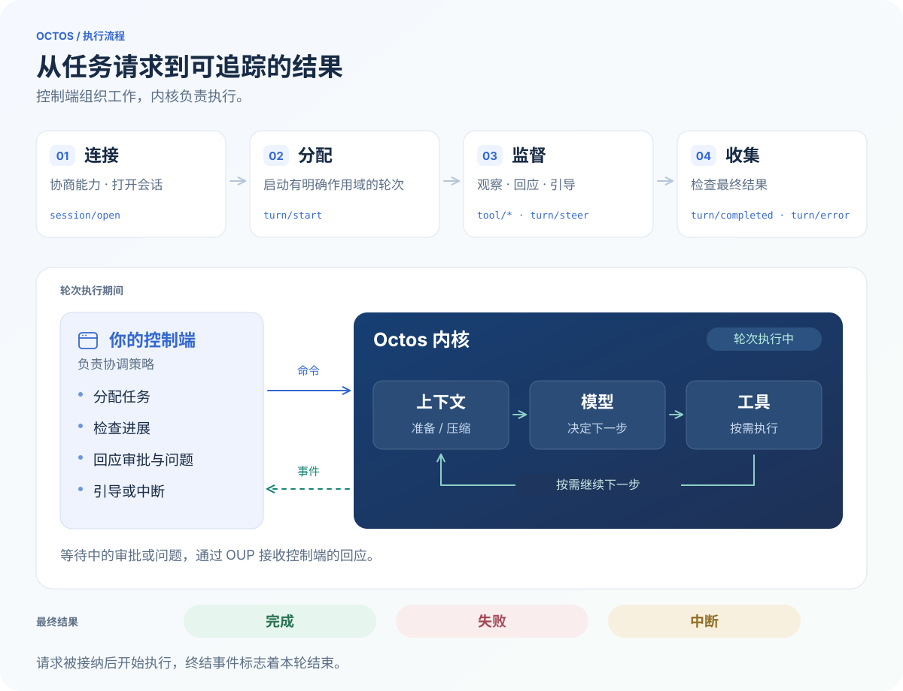

<div align="center">

<pre>
 ██████╗  ██████╗████████╗ ██████╗ ███████╗
██╔═══██╗██╔════╝╚══██╔══╝██╔═══██╗██╔════╝
██║   ██║██║        ██║   ██║   ██║███████╗
██║   ██║██║        ██║   ██║   ██║╚════██║
╚██████╔╝╚██████╗   ██║   ╚██████╔╝███████║
 ╚═════╝  ╚═════╝   ╚═╝    ╚═════╝ ╚══════╝
</pre>

</div>

# Octos

**用 Rust 编写、可嵌入应用的 AI Agent Harness 内核。**

Octos 为 AI Agent 应用提供执行循环、上下文管理、记忆、工具、技能、工作流和
Agent 协作能力。你可以将内核编译进自己的应用，也可以通过 **OUP（Octos UI
Protocol，Octos UI 协议）** 托管和控制它，让原生应用、终端、浏览器或另一个
Agent 驱动同一套运行时。

Octos 的核心架构是 **可复用的内核 + 可编程的协议边界**。应用负责界面和产品
流程，Octos 负责 Agent 执行与运行时状态。面向人的客户端和自动化控制端，都能
通过同一套 OUP 契约操作这个内核。

[构建应用](#基于-octos-构建应用) · [通过 OUP 控制内核](#通过-oup-控制内核) ·
[文档](https://octos-org.github.io/octos/zh/) · [English](README.md)

## 想直接使用编码 Agent？

请从基于内核构建的应用开始：

| 应用 | 从哪里开始 |
| --- | --- |
| **[Octoscode](https://github.com/octos-org/octoscode)** | 安装终端客户端；首次启动时会自动准备兼容的本地 Octos 运行时。 |
| **[Octoscode Web](https://github.com/octos-org/octoscode-web)** | 按照[入门指南](https://github.com/octos-org/octoscode-web/blob/main/docs/getting-started.md)部署浏览器客户端，并连接 Octos 运行时。 |

本仓库面向嵌入、扩展或集成 Harness 内核的开发者。应用安装和日常编码操作，
请查看上面的客户端仓库。

## 基于 Octos 构建应用

用 Octos 构建编码应用、带 Agent 能力的桌面应用、研究服务、工作流引擎，或一组
协作 Agent。界面、模型提供者、工具和宿主环境都由你的应用选择。

### 内核架构

将 Rust crates 或任务执行绑定嵌入应用，或通过 OUP 连接托管运行时。
OUP 将命令传入内核，并将响应与事件返回客户端或控制端。



### 原生内核与库

Rust workspace 可以按应用需要组合：

| Crate | 在应用中的职责 |
| --- | --- |
| [`octos-core`](crates/octos-core) | 共享类型、OUP 命令、通知与协议编解码 |
| [`octos-agent`](crates/octos-agent) | Agent 执行、上下文处理、工具、hooks、沙箱与任务监督 |
| [`octos-memory`](crates/octos-memory) | 持久化记忆、任务经验与检索 |
| [`octos-llm`](crates/octos-llm) | 模型提供者接口、路由、重试与故障转移 |
| [`octos-plugin`](crates/octos-plugin) | 技能与插件集成 |
| [`octos-pipeline`](crates/octos-pipeline) / [`octos-swarm`](crates/octos-swarm) | 工作流图、并行执行、验证与结果汇总 |
| [`octos-bus`](crates/octos-bus) / [`octos-cli`](crates/octos-cli) | 会话基础设施、运行时组装、OUP 托管与适配层 |

在源码仓库中，构建原生 Agent 库或供其他语言调用的库：

```bash
cargo build --release -p octos-agent
cargo build --release -p octos-ffi
```

集成到其他 workspace 时，将相关 Octos crates 固定在同一个 Git revision。
其他宿主语言可以使用 [C ABI](crates/octos-ffi/README.md)、
[原生 Python 绑定](crates/octos-pyo3/README.md)或
[Swift/Kotlin 绑定](crates/octos-uniffi/README.md)。C ABI 同时提供动态库和静态库。
这些绑定提供任务执行接口；下文的 OUP 提供会话、轮次、监督与回放接口。

### 操作系统与处理器架构

面向 **Linux、Windows、macOS** 构建原生应用。CI 配置包含 Linux x86-64 与
ARM64、macOS ARM64，以及 Windows x86-64。**RISC-V** 已定义手动 CI 任务，
但仍是未验证的目标：配置中记录该任务尚未有 runner 执行。根据目标选择 crates、
features 和原生依赖，具体支持取决于这一组合。

其他操作系统上的应用可以通过 OUP 接入，也可以移植内核的平台集成部分，包括
进程执行、文件系统访问与沙箱；应用和内核之间继续使用同一套协议边界。

浏览器应用可以使用 [WASM crate](crates/octos-wasm/README.md)中的协议与工具类型。
完整 Agent 内核运行在原生环境中，浏览器通过 OUP 与之通信。

## 通过 OUP 控制内核

**OUP（Octos UI Protocol）** 是面向应用与 Agent 控制端的 JSON-RPC 2.0 接口，
通过 WebSocket 或按行分隔的 stdio 传输请求、响应和类型化运行时事件。
本地运行时适配层也通过进程内连接使用 OUP dispatcher。

本地控制端可以使用参考宿主 `octos serve --stdio`，由启用 `api` feature 的
`octos-cli` 构建。WebSocket 客户端连接运行中宿主的 `/api/ui-protocol/ws`
端点，并使用该宿主的认证配置。JSON-RPC 请求 ID 使用字符串。

Stdio 客户端通过 `client_hello` 协商 features；WebSocket 客户端通过
`X-Octos-Ui-Features` 或 `ui_feature` 查询参数请求 features。然后查询
`config/capabilities/list`，根据运行时公告的方法与能力选择控制方式和事件格式。对话历史、执行状态、压缩、权限与已提交
结果由运行时管理；客户端通过协议展示这些状态，或据此采取行动。

### 让另一个 Agent 驱动 Octos

控制端集成可以将 OUP 请求封装成 **Codex、Claude Code 或其他 Agent** 可调用的
工具，让控制 Agent 向 Octos Agent 分配任务、观察执行、介入过程并收集结果。
OUP 客户端或桥接层由这项集成提供。

典型控制流程：

1. **连接并协商能力。** 建立传输连接，协商 features，并查询
   `config/capabilities/list`。
2. **打开有明确作用域的会话。** 通过 `session/open` 指定会话标识、profile 和
   workspace，保存运行时确认的会话标识。
3. **分配工作。** 使用新的 turn ID 和结构化输入发送 `turn/start`。
   RPC 响应表示轮次已被接纳；通过协商后的事件流跟踪最终结果。
4. **观察并介入。** 接收消息、工具、任务和进度事件。使用 `turn/steer` 追加指令，
   使用 `turn/interrupt` 停止轮次；需要授权决定或回答时，调用
   `approval/respond` 或 `user_question/respond`。
5. **协作与恢复。** 通过 `peer/prepare` 准备 Peer 的任务说明和可选 worktree，
   再打开其会话并启动轮次。通过 `peer/gather` 收集持久化结果，通过 `task/*`
   检查输出和产物；重连后重新加载会话，或从已提交的 cursor 继续回放。

轮次被接纳后，控制端通过事件流跟踪执行。审批、提问与控制端介入按需发生；
完成、失败或中断都会结束当前轮次。



例如，打开会话后，控制端可以发送下面的 `turn/start` 请求。将会话占位符替换为
运行时确认的标识，并为每个轮次生成新的 UUID：

```json
{
  "jsonrpc": "2.0",
  "id": "request-1",
  "method": "turn/start",
  "params": {
    "session_id": "<confirmed-session-id>",
    "turn_id": "550e8400-e29b-41d4-a716-446655440000",
    "input": [
      { "kind": "text", "text": "审查这个工作区中的改动，报告问题并标明文件与行号。" }
    ]
  }
}
```

同一个控制端可以让 Octos 执行研究或实现任务，检查结果，再调整下一轮工作。
OUP 提供将这种协作方式集成到应用中所需的控制接口与执行证据。

## 从 OUP 看内核能力

OUP 让应用能够在任务的整个生命周期中控制 Harness：检查 Agent 正在使用的
上下文、回应工具审批、监督并行工作、恢复已提交的结果，都使用同一套运行时契约。
内核负责执行与持久化，应用决定如何呈现状态、何时介入，以及如何组织下一步工作。

下列接口的可用性取决于运行时、传输方式和已协商的 features。集成时通过
`config/capabilities/list` 发现能力，检查 `supported_methods` 与
`supported_features`，并按协商后的格式接收事件，让应用适配实际连接的运行时。

### 上下文管理

长任务会不断积累对话、工具输出与中间结果。Octos 管理模型的上下文预算，压缩较早
的内容，并保留近期工具调用与结果之间的对应关系。压缩可以采用 LLM 摘要或启发式
策略；稳定的提示前缀有助于提供者复用缓存，变化中的任务状态则进入持续演进的对话。

- **检查状态：** 协商 `context.lifecycle.v1` 后，通过 `session/status/read`
  和 `session/hydrate` 读取运行时的上下文状态与压缩记录，了解处理后模型实际
  可以看到的上下文。
- **主动控制：** 使用 `session/compact` 请求压缩，使用
  `session/compact/mode/set` 选择当前会话的压缩模式。
- **观察变化：** 通过 `context/compaction_started` 和
  `context/compaction_completed`，向用户或控制 Agent 解释上下文何时发生了变化。

编码应用可以展示上下文用量与压缩历史；控制 Agent 可以在分配长任务的下一阶段前，
检查执行 Agent 的上下文状态。

### 跨任务记忆

记忆层提供长期笔记、实体页面、任务经验记录与检索能力。混合索引将关键词搜索与
可用 embedding 的向量相似度结合，让应用能够在不同会话间保留项目约定、设计决策
和有用的任务结论。

- **查看已有知识：** 在公告 `auxiliary.rest_to_ws.v1` 的 WebSocket 连接上，
  通过 `memory/overview` 和 `memory/entity` 查看 profile 记忆。
  这两个方法在 stdio 连接上不可用。
- **在执行中读写：** 配备记忆工具的 Agent 可以使用 `recall_memory`、
  `save_memory` 等工具检索和更新知识；这些名称属于 Agent 工具，并非 OUP RPC。
- **区分用途：** 记忆提供可复用的知识；会话历史与事件回放记录某次对话实际发生了什么。

### 持久化会话与恢复

Octos 管理会话标识、工作区作用域、对话历史和已提交事件。客户端可以在重新加载后
重建运行时中的对话状态，也可以为同一个已存储会话提供不同的交互界面。

- **打开与检查：** `session/open` 建立会话并确认工作区；`session/hydrate`
  恢复消息、轮次、待处理审批等请求的状态；`turn/state/get` 查询指定轮次的生命周期。
- **断线重连：** 保存最后应用的持久化 cursor，重新打开会话时传入 `after`。
  运行时先回放保留的已提交事件，再接入实时事件。尚未提交的增量可能丢失，过期 cursor
  需要重新加载状态；能够回放历史也不代表断线前的轮次仍在运行。
- **分支与回退：** `session/fork` 创建对话分支，`session/rollback` 回退对话轮次。
  对话回退不会撤销文件系统中的修改。

### 工具、权限与人工输入

内核按照宿主的工具策略与平台沙箱配置执行文件系统、shell、Web 和 MCP 工具。
宿主配置的生命周期 hooks 可以在模型调用和工具执行前后介入。OUP 暴露执行过程与
需要决定的节点，让应用提供自己的审批界面，或将已授权范围内的决定交给控制 Agent。

- **发现与观察：** `tool/status/list` 和 `mcp/status/list` 报告可用集成；
  `tool/started`、`tool/progress` 和 `tool/completed` 让客户端跟踪工具执行。
- **控制权限：** 使用 `permission/profile/list` 与 `permission/profile/set`
  发现并选择权限配置；对于待处理的修改提案，通过 `diff/preview/get` 读取运行时
  提供的差异预览。
- **回应待处理决定：** 用 `approval/respond` 回应 `approval/requested`，
  用 `user_question/respond` 回应 `user_question/requested`，关联原请求的标识，
  并遵守宿主的授权策略。

应用由此可以展示修改提案、收集决定、继续等待中的操作，并保留这次交互与所属轮次
之间的关联。

### 技能与扩展

技能封装可复用指令和可执行能力；插件通过 manifest 声明工具与动作，并支持发现及
环境条件检查。宿主可以为 Agent 加入领域能力，继续复用内核的执行与监督机制。

- **管理 profile 技能：** 使用 `profile/skills/list`、
  `profile/skills/registry/search`、`profile/skills/install` 和
  `profile/skills/remove` 完成查询、搜索、安装与移除。
- **提供应用动作：** `skill/action/list` 发现已声明动作，`skill/action/invoke`
  执行动作。宿主可以把动作呈现为按钮、自动化步骤，或另一个 Agent 可调用的工具。
- **跟踪后台动作：** `skill/action/job/list` 和 `skill/action/job/read`
  查询持久化任务；支持时，通过 `skill/action/job/updated` 跟踪生命周期变化。

### 工作流与任务监督

Pipeline 库用 DOT 图描述多步骤任务，支持逐节点模型选择、并行分支、条件、检查点、
人工确认节点与产物验证。宿主可以通过 Rust 库组装工作流，也可以让 Agent 通过工具
启动已配置的工作流，再通过 OUP 监督生成的任务。

- **跟踪执行：** `task/list`、`task/updated` 和 `task/output/delta` 提供任务
  状态与实时输出；`task/output/read` 读取已记录的输出；`task/artifact/list`
  和 `task/artifact/read` 提供保留的产物。
- **介入与恢复：** `task/cancel` 停止指定作用域中的活动任务；
  `task/restart_from_node` 重新启动已结束的任务并返回新的任务 ID，支持此能力的
  Pipeline 任务可以从指定节点重新开始。
- **使用内置编排入口：** 当运行时公告 `review/start` 时，可以启动受监督的审查
  工作流，并通过同一套轮次、任务和 Agent 接口跟踪进展。

应用可以展示工作流进度，检查失败的验证步骤及其输出，再请求适当的重试并跟踪新任务。

### 子 Agent 与 Peer 协作

Octos 提供多种并行执行方式：子 Agent 接受委派任务并向父 Agent 返回结果；Peer
拥有独立会话，可由客户端或控制端检查和引导；受监督的后台工具任务可以不创建新的
LLM 循环。

- **监督委派工作：** 使用 `agent/list`、`agent/status/read`、`agent/output/read`
  和 `agent/artifact/*` 查询状态、输出与产物。这套监督接口也覆盖支持的后台任务，
  因而其中的条目不一定对应独立的模型对话。
- **准备独立 Peer：** `peer/prepare` 保存持久化任务说明，并可创建独立 Git
  worktree。这个调用负责准备资源；控制端随后通过 `session/open` 和 `turn/start`
  启动各 Peer 的工作。
- **协调与收集：** 通过普通轮次控制接口引导 Peer，使用 `peer/gather` 读取任务
  说明和 Peer 轮次结束时持久化的最新结果，再由控制端决定如何汇总。

例如，宿主可以为实现和审查分配不同会话与 worktree，在审查任务中指定待审查的修改，
再把双方的结论收集到协调会话。

### 目标、循环与监控

Goal 记录 Agent 要完成什么，Loop 安排周期性轮次，Monitor 观察命令输出并在匹配
事件出现时唤醒 Agent。这些机制组合起来，支持跨多个轮次持续推进的工作，并让应用
能够检查和控制其状态。

- **持久化目标：** `session/goal/set`、`session/goal/get` 和
  `session/goal/clear` 管理目标。目标记录包含状态、Token 预算、Token 用量和累计
  使用时间；`session/goal/updated` 报告变化。
- **安排周期性工作：** `loop/create`、`loop/list`、`loop/pause`、`loop/resume`、
  `loop/fire_now` 和 `loop/delete` 管理循环执行；循环事件报告触发与完成。
- **响应外部信号：** `monitor/create` 配置命令、输出过滤条件与投递限制；
  `monitor/list`、`monitor/pause`、`monitor/resume` 和 `monitor/delete`
  管理监控；`monitor/fired` 报告匹配的活动。

宿主可以安排定期项目检查，或在受监控的构建输出错误时唤醒 Agent；界面同时展示目标、
已用预算、活动计划，以及暂停后续工作的控制项。

### 模型提供者与路由

模型层集成不同提供者，支持模型配置、重试与故障转移链，以及自适应路由。应用可以为
交互式任务选择模型，也可以为工作流节点配置不同的提供者通道。

- **配置提供者：** `profile/llm/catalog`、`profile/llm/list`、`profile/llm/upsert`、
  `profile/llm/test` 和 `profile/llm/select` 支持发现、配置、连接测试与选择。
- **配置工作流通道：** 已公告的 `profile/sub_providers/*` 方法管理逐节点路由使用的
  命名提供者通道；修改在对应运行时重新构建后生效。
- **检查路由：** `router/status` 和 `router/failover` 提供路由事件；
  `router/get_metrics` 与 `router/set_mode` 提供已公告的指标查询和控制接口。

### 把这些能力组合起来

通过适配器接入的 Codex、Claude Code 或自定义 Agent，可以基于这些机制实现
“实现—审查—修正”的控制流程：

1. 打开绑定工作区的会话，发现可用能力；支持 Goal 时，设置具体目标与预算。
2. 为范围明确的实现或调查任务准备 Peer，打开各自的会话，并带着明确任务说明启动轮次。
3. 跟踪工具和任务事件，回应已授权的审批，在出现新约束时引导正在执行的工作。
   各会话内的上下文管理、工具调用与已配置工作流由内核执行。
4. 收集 Peer 结果，检查任务输出与产物，再启动审查或验证工作，根据证据决定是否需要
   下一轮修改。
5. 保存会话标识与持久化 cursor，让界面在重连时重新加载已提交状态。

宿主实现协调策略，Octos 提供执行、状态与控制机制，并通过 OUP 暴露可观察的过程。

## 开发者文档

- [OUP 协议规范](api/OCTOS_UI_PROTOCOL_V1_SPEC_2026-04-24.md)
- [OUP 类型与编解码](crates/octos-core/src/ui_protocol.rs)
- [运行时架构](docs/ARCHITECTURE.md)
- [Harness 开发者接口](docs/OCTOS_HARNESS_DEVELOPER_INTERFACE.md)
- [产物与工作流集成指南](docs/OCTOS_HARNESS_DEVELOPER_GUIDE.md)
- [Harness 兼容性与版本管理](docs/OCTOS_HARNESS_ABI_VERSIONING.md)
- [文档站点](https://octos-org.github.io/octos/zh/)

## 参与开发

根据修改涉及的 crates 运行相应检查。Workspace 检查命令：

```bash
cargo fmt --all -- --check
cargo clippy --workspace --all-targets -- -D warnings
cargo test --workspace
```

协议变更需要同步维护规范、Rust 类型、运行时分发、能力公告与客户端行为。

## 许可证

Apache-2.0，详见 [LICENSE](LICENSE)。
