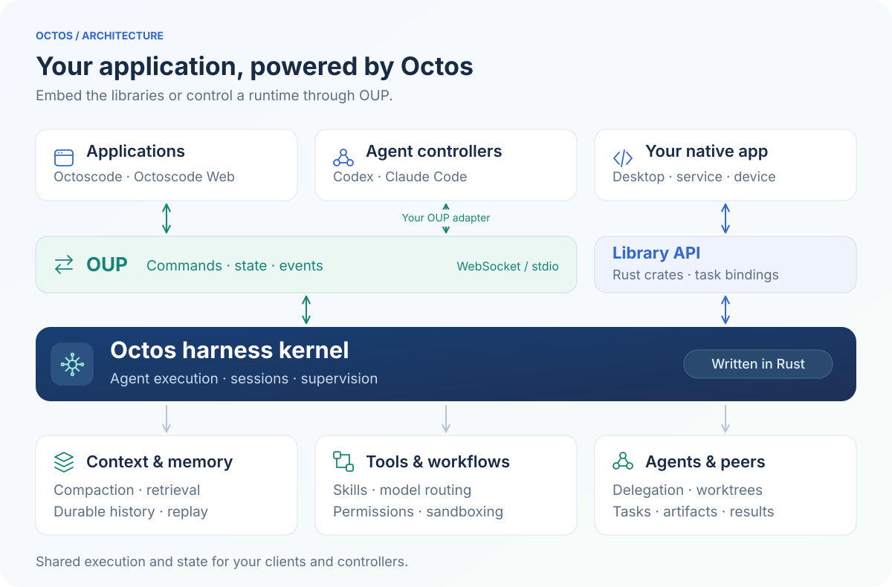
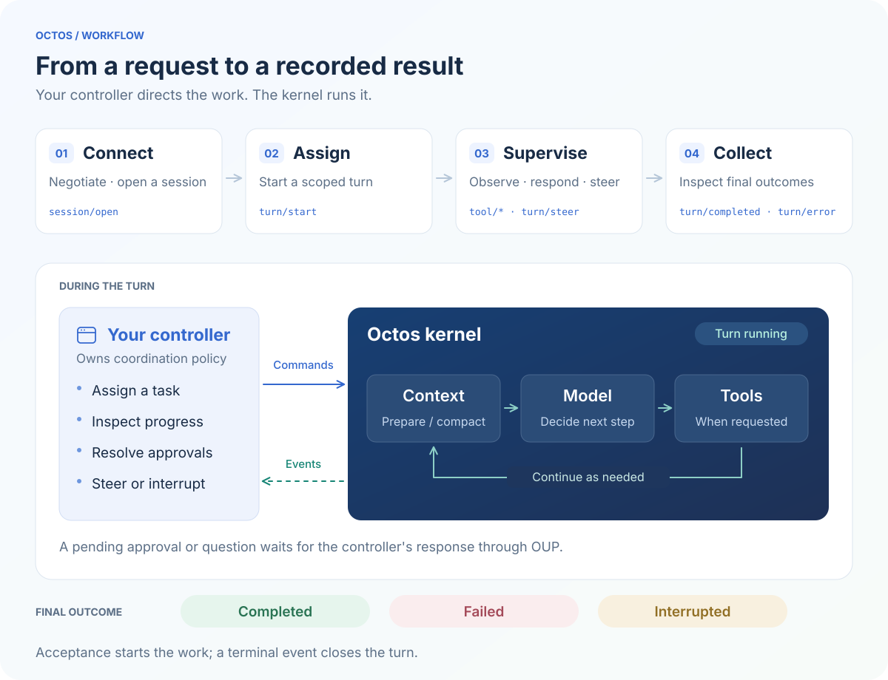

> **这是 Octos 参加 ARC-Bench 的比赛版仓库。** 内核源码在 `crates/`，参赛所需的全部外围（平台适配包、公开验收测试、本机做题与打分、打包上传）在 [`arc/`](arc/README.md)。参与Arc-Bench只需要这一个仓库。分支：`main` 是魔改版全量源码加 `arc/`；`adapter` 分支只有适配包，给想搭配官方 Octos 或别的 agent 使用的人。固定基底：上游 octos-org/octos 提交 8558a3bf（标签 arc-base-20260910）；版本约束见 `arc-runtime-lock.json`。

<div align="center">

<pre>
 ██████╗  ██████╗████████╗ ██████╗ ███████╗
██╔═══██╗██╔════╝╚══██╔══╝██╔═══██╗██╔════╝
██║   ██║██║        ██║   ██║   ██║███████╗
██║   ██║██║        ██║   ██║   ██║╚════██║
╚██████╔╝╚██████╗   ██║   ╚██████╔╝███████║
 ╚═════╝  ╚═════╝   ╚═╝    ╚═════╝ ╚══════╝
</pre>

</div>

# Octos

**An embeddable AI agent harness kernel, written in Rust.**

Octos provides the execution loop, context management, memory, tools, skills,
workflows, and agent coordination for applications built around AI agents.
Compile the kernel into your own application, or host it behind **OUP — the
Octos UI Protocol** — and control it from a native app, a terminal, a browser,
or another agent.

The defining architecture is **a reusable kernel with a programmable protocol
boundary**. Your application owns its interface and product workflow; Octos
owns agent execution and runtime state. The same OUP contract lets a human-facing
client and an automated controller operate that runtime.

[Build with Octos](#build-with-octos) · [Control through OUP](#control-through-oup) ·
[Documentation](https://octos-org.github.io/octos/) · [中文](README-zh.md)

<a id="start-here"></a>
<a id="quick-start"></a>

## Looking for a coding agent to use?

Start with an application built on the kernel:

| Application | Where to start |
| --- | --- |
| **[Octoscode](https://github.com/octos-org/octoscode)** | Install the terminal client. It provisions a compatible local Octos runtime on first launch. |
| **[Octoscode Web](https://github.com/octos-org/octoscode-web)** | Set up the browser client using its [getting-started guide](https://github.com/octos-org/octoscode-web/blob/main/docs/getting-started.md), and connect it to an Octos runtime. |

This repository is for developers embedding, extending, or integrating the
harness kernel. Application installation and everyday coding workflows belong
in the client repositories above.

<a id="embed-octos"></a>

## Build with Octos

Use Octos as the foundation for a coding application, an agent-powered desktop
app, a research service, a workflow engine, or a fleet of cooperating agents.
Bring your own interface, model providers, tools, and host environment.

### Kernel architecture

Embed the Rust crates or task bindings in your application, or connect through
OUP to a hosted runtime. OUP carries both commands into the kernel and responses
and events back to the client or controller.



### Native kernel and libraries

The Rust workspace lets you compose the parts your application needs:

| Crate | Role in your application |
| --- | --- |
| [`octos-core`](crates/octos-core) | Shared types, OUP commands, notifications, and wire codecs |
| [`octos-agent`](crates/octos-agent) | Agent execution, context handling, tools, hooks, sandboxing, and task supervision |
| [`octos-memory`](crates/octos-memory) | Persistent memory, episodes, and retrieval |
| [`octos-llm`](crates/octos-llm) | Provider interfaces, model routing, retries, and failover |
| [`octos-plugin`](crates/octos-plugin) | Skill and plugin integration |
| [`octos-pipeline`](crates/octos-pipeline) / [`octos-swarm`](crates/octos-swarm) | Workflow graphs, parallel workers, validation, and result aggregation |
| [`octos-bus`](crates/octos-bus) / [`octos-cli`](crates/octos-cli) | Session infrastructure, runtime composition, and OUP hosting/adapters |

From a checkout, build the native agent library or a library for a non-Rust host:

```bash
cargo build --release -p octos-agent
cargo build --release -p octos-ffi
```

Pin related Octos crates to the same Git revision when integrating them into
another workspace. For other host languages, use the
[C ABI](crates/octos-ffi/README.md), [native Python binding](crates/octos-pyo3/README.md),
or [Swift/Kotlin bindings](crates/octos-uniffi/README.md). The C ABI produces
shared and static libraries. These bindings expose task execution; OUP provides
the session, turn, supervision, and replay interface described below.

### Platforms and architectures

Build native applications for **Linux, Windows, and macOS**. CI configurations
include Linux x86-64 and ARM64, macOS ARM64, and Windows x86-64. **RISC-V** has a
manual CI definition, but remains an unverified target: the configuration records
that no runner has executed the job. Select the crates, features, and native
dependencies for your target; support depends on that combination.

Other operating systems can connect an application through OUP or port the
kernel's platform integrations, including process execution, filesystem access,
and sandboxing. The application/protocol boundary stays the same.

For browser applications, [the WASM crate](crates/octos-wasm/README.md) supplies
protocol and utility types. The full agent kernel runs natively, with the
browser communicating over OUP.

## Control through OUP

**OUP (Octos UI Protocol)** is a JSON-RPC 2.0 interface for applications and agent
controllers. It carries requests, responses, and typed runtime events over
WebSocket or newline-delimited stdio. Local runtime adapters also use an
in-process connection to the OUP dispatcher.

For a local controller, the reference host is `octos serve --stdio`, built from
`octos-cli` with the `api` feature. A WebSocket client connects to a running
host's `/api/ui-protocol/ws` endpoint using that host's authentication settings.
Use string JSON-RPC request IDs.

Stdio clients negotiate features with `client_hello`; WebSocket clients request
them through `X-Octos-Ui-Features` or the `ui_feature` query parameter. Query
`config/capabilities/list` to discover supported methods, then use the advertised
capabilities to choose controls and event formats. The runtime owns conversation history, execution state,
compaction, permissions, and committed results; clients render or act on that
state through the protocol.

### Drive Octos from another agent

A controller integration can expose OUP requests as tools callable by **Codex,
Claude Code, or another agent**. This gives the controlling agent a way to
assign work to Octos agents, observe execution, intervene, and collect results.
The integration supplies the OUP client or bridge.

A typical controller flow is:

1. **Connect and negotiate.** Establish a transport, negotiate feature support,
   and query `config/capabilities/list`.
2. **Open a scoped session.** Use `session/open` with the session identity,
   profile, and workspace; retain the identity confirmed by the runtime.
3. **Assign work.** Send `turn/start` with a fresh turn ID and structured input.
   The RPC acknowledgement means the turn was accepted; follow the negotiated
   event stream to its terminal outcome.
4. **Observe and intervene.** Consume message, tool, task, and progress events.
   Use `turn/steer` to add instructions, `turn/interrupt` to stop a turn, and
   `approval/respond` or `user_question/respond` when an authorized decision or
   answer is needed.
5. **Coordinate and recover.** Use `peer/prepare` to stage a peer's brief and
   optional worktree, then open its session and start its turn. Gather durable
   peer results through `peer/gather`; inspect task output and artifacts through
   `task/*`. Rehydrate a session or resume from its committed cursor after a
   reconnect.

The controller follows the event stream after a turn is accepted. Approvals,
questions, and interventions are optional; completion, failure, or interruption
ends the turn.



For example, after opening a session, a controller can send this `turn/start`
request. Replace the session placeholder with the confirmed session ID and use
a new UUID for each turn:

```json
{
  "jsonrpc": "2.0",
  "id": "request-1",
  "method": "turn/start",
  "params": {
    "session_id": "<confirmed-session-id>",
    "turn_id": "550e8400-e29b-41d4-a716-446655440000",
    "input": [
      { "kind": "text", "text": "Review the changes in this workspace and report findings with file and line references." }
    ]
  }
}
```

The same controller can let Octos perform research or implementation, inspect
its findings, then steer the next turn. OUP exposes the controls and evidence
needed to build that collaboration into your own application.

## Kernel capabilities through the OUP lens

OUP makes the harness programmable throughout a task's lifecycle. An application
can inspect the context an agent is using, respond to a tool approval, supervise
parallel work, and recover committed results through the same runtime contract.
The kernel manages execution and persistence; the application decides how to
present that state and when to intervene.

The surfaces below depend on the runtime, transport, and negotiated features.
Discover them through `config/capabilities/list`, check `supported_methods` and
`supported_features`, and consume the negotiated event format. Capability
discovery lets an integration adapt to the runtime it is actually connected to.

### Context management

Long tasks accumulate conversation, tool output, and intermediate results.
Octos manages the model's context budget, compacts older material, and preserves
recent tool-call/result relationships. Compaction can use LLM summarization or
heuristics. Stable prompt prefixes support provider cache reuse, while changing
task state remains part of the evolving conversation.

- **Inspect:** `session/status/read` and `session/hydrate` expose the runtime's
  context state when `context.lifecycle.v1` is negotiated, including compaction
  metadata. These describe the context available to the model after processing.
- **Control:** `session/compact` requests a compaction pass;
  `session/compact/mode/set` selects the session's compaction mode.
- **Observe:** `context/compaction_started` and `context/compaction_completed`
  let an application explain when and how context changed during execution.

A coding app can show context usage and compaction history; an agent controller
can inspect that state before assigning the next stage of a long task.

### Memory across tasks

The memory layer provides long-term notes and entity pages, episodic task
records, and retrieval. Its hybrid index combines keyword search with vector
similarity when embeddings are available. An application can retain project
conventions, decisions, and useful task outcomes across sessions.

- **Inspect stored knowledge:** `memory/overview` and `memory/entity` expose
  profile memory on WebSocket connections that advertise
  `auxiliary.rest_to_ws.v1`. These methods are unavailable over stdio.
- **Use memory during execution:** agents equipped with memory tools can
  retrieve and update knowledge through tools such as `recall_memory` and
  `save_memory`. Those are agent tools, not OUP RPC method names.
- **Keep the roles distinct:** memory supplies reusable knowledge; session
  history and event replay record what happened in a particular conversation.

### Durable sessions and recovery

Octos owns session identity, workspace scope, conversation history, and committed
events. A client can reconstruct the runtime's view of a conversation after a
reload, or build a different interface over the same stored session.

- **Open and inspect:** `session/open` establishes the session and confirmed
  workspace. `session/hydrate` restores messages, turns, pending approvals, and
  other requested state; `turn/state/get` inspects a specific turn's lifecycle.
- **Reconnect:** retain the last applied durable cursor and pass `after` when
  reopening the session. The runtime replays retained committed events before
  live delivery. Uncommitted deltas may be lost, and expired cursors require
  fresh hydration; replay does not imply an active turn survived a disconnect.
- **Branch or rewind:** `session/fork` creates a conversation branch, and
  `session/rollback` rewinds conversation turns. Conversation rollback does not
  undo filesystem changes.

### Tools, permissions, and human input

The kernel executes filesystem, shell, web, and MCP tools under the host's tool
policy and platform sandbox configuration. Host-configured lifecycle hooks can
participate around model calls and tool execution. OUP exposes execution and
decision points so the application can provide its own approval interface or
delegate authorized decisions to a controller.

- **Discover and observe:** `tool/status/list` and `mcp/status/list` report
  available integrations. `tool/started`, `tool/progress`, and `tool/completed`
  expose tool execution to the client.
- **Control permissions:** discover and select permission profiles through
  `permission/profile/list` and `permission/profile/set`. For a pending change
  proposal, `diff/preview/get` provides the canonical diff preview.
- **Resolve a pending decision:** answer `approval/requested` with
  `approval/respond`, or `user_question/requested` with `user_question/respond`,
  using the originating request's identity and the host's authorization policy.

This supports an application that shows a proposed edit, collects a decision,
and resumes the waiting operation while preserving its connection to the turn.

### Skills and extensions

Skills package reusable instructions and executable capabilities. Plugins add
manifest-declared tools and actions, with discovery and environment gating.
These let a host give its agents domain-specific behavior while reusing the
kernel's execution and supervision machinery.

- **Manage the profile's skills:** use `profile/skills/list`,
  `profile/skills/registry/search`, `profile/skills/install`, and
  `profile/skills/remove`.
- **Expose application actions:** `skill/action/list` discovers declared
  actions; `skill/action/invoke` runs them. A host can present an action as a
  button, an automation step, or a tool for another agent.
- **Track background actions:** `skill/action/job/list` and
  `skill/action/job/read` inspect persisted jobs;
  `skill/action/job/updated` reports lifecycle changes when supported.

### Workflows and task supervision

The pipeline library represents multi-step work as DOT graphs, with per-node
model selection, parallel branches, conditions, checkpoints, human gates, and
artifact validation. A host can compose workflows through the Rust library, or
let an agent launch a configured workflow through its tools. OUP exposes the
resulting supervised tasks to the application.

- **Follow execution:** `task/list`, `task/updated`, and `task/output/delta`
  provide task state and live output. `task/output/read` retrieves recorded
  output; `task/artifact/list` and `task/artifact/read` expose retained artifacts.
- **Intervene and recover:** `task/cancel` stops a scoped active task.
  `task/restart_from_node` relaunches a terminal task and returns a new task ID;
  supported pipeline tasks can restart from a selected node.
- **Use a built-in orchestration entry point:** when advertised, `review/start`
  starts the runtime's supervised review workflow and reports progress through
  the same turn, task, and agent surfaces.

An application can present a workflow's progress, inspect a failed validation
and its output, then request an appropriate retry and track the successor task.

### Sub-agents and peers

Octos supports several forms of concurrent work. A child agent handles a
delegated task and returns its result to its parent. A peer owns an independent
session that a client or controller can inspect and steer. A supervised
background tool task can run without creating another LLM loop.

- **Supervise delegated work:** `agent/list`, `agent/status/read`,
  `agent/output/read`, and `agent/artifact/*` expose status, output, and
  artifacts. This supervision surface also covers supported background tasks;
  an entry does not necessarily represent a separate model conversation.
- **Prepare independent peers:** `peer/prepare` stores a durable brief and can
  create a separate Git worktree. Preparation stages resources; the controller
  then uses `session/open` and `turn/start` to launch each peer's work.
- **Coordinate and gather:** steer a peer through its ordinary turn controls,
  and use `peer/gather` to read staged briefs and the latest results persisted
  at peer turn termination. The controller decides how to combine those results.

For example, a host can give implementation and review separate sessions and
worktrees, point the reviewer at the implementation's changes, then collect
their findings into a coordinating session.

### Goals, loops, and monitors

A goal records what the agent is working toward. A loop schedules recurring
turns. A monitor watches a command's output and wakes an agent when matching
events arrive. Together, these primitives support work that spans multiple
turns, with state the application can inspect and control.

- **Persist an objective:** `session/goal/set`, `session/goal/get`, and
  `session/goal/clear` manage goal state. Goal records include status, token
  budget, token usage, and elapsed usage time; `session/goal/updated` reports
  changes.
- **Schedule recurring work:** `loop/create`, `loop/list`, `loop/pause`,
  `loop/resume`, `loop/fire_now`, and `loop/delete` manage recurring execution.
  Loop events expose when runs fire and complete.
- **React to external signals:** `monitor/create` configures a command, output
  filter, and delivery limits. `monitor/list`, `monitor/pause`, `monitor/resume`,
  and `monitor/delete` manage it; `monitor/fired` reports matching activity.

A host might schedule periodic project checks or wake an agent when a monitored
build emits an error. Its interface can show the objective, consumed budget,
active schedules, and controls for pausing further work.

### Model providers and routing

The model layer provides provider adapters, configurable model choices, retry
and fallback chains, and adaptive routing. The application can choose models
for interactive work and configure separate provider lanes for workflow nodes.

- **Configure providers:** `profile/llm/catalog`, `profile/llm/list`,
  `profile/llm/upsert`, `profile/llm/test`, and `profile/llm/select` support
  discovery, configuration, connection testing, and selection.
- **Configure workflow lanes:** the advertised `profile/sub_providers/*`
  methods manage named provider lanes for per-node routing. Changes take effect
  when the corresponding runtime is rebuilt.
- **Inspect routing:** `router/status` and `router/failover` expose routing
  events; `router/get_metrics` and `router/set_mode` provide the advertised
  metrics and control surface.

### Putting the capabilities together

A Codex, Claude Code, or custom-agent integration can build a review-and-fix
controller around these primitives:

1. Open a workspace-scoped session, discover capabilities, and set a concrete
   objective and budget if goal support is available.
2. Prepare peers for bounded implementation or investigation tasks, open their
   sessions, and start their turns with explicit briefs.
3. Follow tool and task events, resolve authorized approvals, and steer ongoing
   work when new constraints arrive. The kernel manages context and executes
   the configured tools and workflows within each session.
4. Gather peer results, inspect task output and artifacts, then launch review or
   verification work. Use that evidence to decide whether another turn is needed.
5. Retain session identities and durable cursors so the interface can rehydrate
   committed state when it reconnects.

The host implements the coordination policy. Octos supplies the execution,
state, and control primitives that make that policy observable through OUP.

## Developer documentation

- [OUP specification](api/OCTOS_UI_PROTOCOL_V1_SPEC_2026-04-24.md)
- [OUP types and codecs](crates/octos-core/src/ui_protocol.rs)
- [Runtime architecture](docs/ARCHITECTURE.md)
- [Harness developer interface](docs/OCTOS_HARNESS_DEVELOPER_INTERFACE.md)
- [Artifact and workflow integration guide](docs/OCTOS_HARNESS_DEVELOPER_GUIDE.md)
- [Harness compatibility and versioning](docs/OCTOS_HARNESS_ABI_VERSIONING.md)
- [Documentation site](https://octos-org.github.io/octos/)

## Contributing

Run the checks appropriate to the crates you change. The workspace checks are:

```bash
cargo fmt --all -- --check
cargo clippy --workspace --all-targets -- -D warnings
cargo test --workspace
```

Protocol changes must keep the specification, Rust types, runtime dispatch,
capability advertisement, and client behavior aligned.

## License

Apache-2.0. See [LICENSE](LICENSE).
